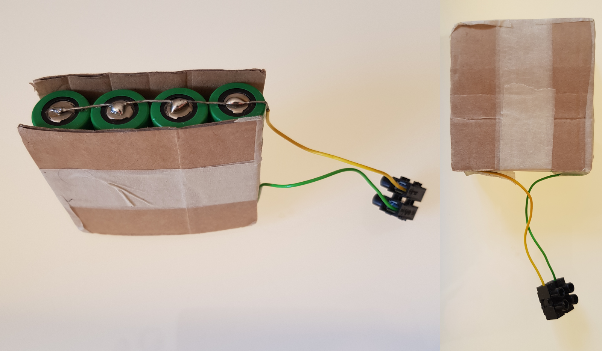

# RPi_Cam_mEyeOS
A Raspberry Pi timelaps and surveillance camera designed to be used in the field, e.g. for a timelaps record of an orchid 
to capture pollination events. The camera is based on a Raspberry Pi Zero W placed in a rugged
casing and running [MotionEyeOS](https://github.com/ccrisan/motioneyeos) by [Calin Crisan](https://github.com/ccrisan).
The battery package used in this instructions should power the camera for about two days,
but can be extended by adding more Li-Ion cells and/or adding a solar panel, which can 
be placed on top of the camera and connected via a cable gland on the side of the housing.
The camera can be built using the following instructions or ordered by sending a
request to armin.niessner@taysira.org (~ 150€).

## Parts

* [Raspberry Pi Zero W](https://www.berrybase.de/raspberry-pi-zero-w?c=311
) (~ 11 €)
* [Raspberry Pi camera 5MP with adjustable focus](https://www.berrybase.de/raspberry-pi-co/raspberry-pi/kameras/kamera-f-252-r-raspberry-pi-mit-einstellbarem-fokus
) (~ 20€)
* [Flexcable for RPi Zero 3.8 cm](https://www.berrybase.de/raspberry-pi-co/raspberry-pi-zero/kabel-adapter/flexkabel-f-252-r-raspberry-pi-zero-und-kameramodul?number=RPIZ-FLEX-038
) (~ 2.50€)
* [64 GB microSD card](https://www.berrybase.de/raspberry-pi-co/raspberry-pi/speicherkarten/sandisk-ultra-microsdxc-a1-100mb/s-class-10-speicherkarte-43-adapter-64gb
) (~ 12€)
* [Rugged casing Bopla M226](https://www.conrad.de/de/p/bopla-euromas-m-226-universal-gehaeuse-120-x-80-x-85-polycarbonat-hellgrau-1-st-531727.html) (~ 18€)
* [DC-DC step-up converter](https://www.amazon.de/gp/product/B079H3YD8V/ref=ppx_yo_dt_b_asin_title_o02_s00?ie=UTF8&th=1
) (~ 1.50€)
* [Li-Ion charging module](https://www.amazon.de/IZOKEE-TP4056-Lademodul-Lithium-Batterie-Charger/dp/B077XW1XBJ/ref=sxbs_sxwds-stvp?__mk_de_DE=%C3%85M%C3%85%C5%BD%C3%95%C3%91&cv_ct_cx=Li+-+Ion+Batterie+Charger+Modul&keywords=Li+-+Ion+Batterie+Charger+Modul&pd_rd_i=B077XW1XBJ&pd_rd_r=69931434-6961-4c63-917f-98a28b135bbf&pd_rd_w=hV3Cf&pd_rd_wg=u14OT&pf_rd_p=1279cacd-3086-45e5-8936-5f39c5f4ad7b&pf_rd_r=777P96ET8ZHDM0WDSGDX&psc=1&qid=1585476913&s=industrial
) (~ 1.50€)
* [Tripod](https://www.amazon.de/gp/product/B00NFWN3YK/ref=ppx_yo_dt_b_asin_title_o04_s01?ie=UTF8&psc=1
) (~ 10€)
* 4 x [Li-Ion battery](https://www.akkuteile.de/lg-inr18650-m36-3-6v-3-7v-3600mah-lithium-ionen-akku_100642_2588
) (~ 17€)
* switch
* strands
* 4-5 x luster terminals
* (optional) cable gland if a solar panel module will be connected
* (optional) solar panel module

## Assembly
### Case modifications:
1. A hole (&#216; 15 mm) for the camera module is drilled in the lid of the case.
1. A hole (&#216; 6 mm) for the tripod screw is drilled in the center of the designated bottom side of the case.
1. (optional) A hole (&#216; 12 mm) is drilled in the upper part of the side wall of the case for a connection to a solar panel module.

### Battery package:
1. The four li-ion batteries are arranged in a row (+ on one side and - on the other side) and fixed e.g. with a piece of cardboard on each side and adhesive tape.
1. Of two approximately 12 cm long strands (preferably of different colours) about 6 cm each is stripped. With the stripped ends of the stranded wires the four poles are soldered together on both sides (at 350°C and with a little soldering fluid). The other sides of the strands are connected to a luster terminal.
1. Both sides of the battery are sealed with adhesive tape.

### Lid preparation:
1. Two pins of the switch are soldered with wires and then the switch is glued to the side wall of the lid with two component glue.
1. One of the wires from the switch is soldered to the VCC pin of the Raspberry Pi Zero and another wire is soldered to one of the GND pins. Afterwards the RPi Zero board is fixed in the lid with velcro.
1. If present, remove the led from the camera board with a soldering iron.
1. The camera module is connected to the RPi Zero with the flex cable and 
placed in the opening provided in the lid (remove the fixing screw from the lens before).

### Final steps:
1. The pins of the dc-dc step-up converter and the battery charger are soldered with wires (the pins on the side of the micro-usb port of the battery charger module are only needed if a solar module is to be connected) and then glued to the side wall of the housing with two component glue.
1. The battery pack is fixed at the bottom of the housing with velcro. The wires of the battery pack are connected to the corresponding pins (B+ and B-) on the battery charger and the pins OUT+ and OUT- are connected to VIN+ and VIN- of the dc-dc step-up converter.
1. Before connecting pins VOUT+ and VOUT- to VCC and GND of the RPi zero, the voltage of the dc-dc step-up converter must be adjusted. To do this, adjust the screw on the potentiometer until a voltage at VOUT of approx. 5.1V is reached.
1. (optional) The cable gland is attached to the 12mm hole and a short 2-core cable piece is fed through. The cable ends on the inside are connected to the pins on the side of the micro-usb port. The cable ends on the outside are connected to a luster terminal.

## Software setup
1. Download the MotionEyeOS image ([v. 20190911](https://github.com/ccrisan/motioneyeos/releases/download/20190911/motioneyeos-raspberrypi-20190911.img.xz) or try new [releases](https://github.com/ccrisan/motioneyeos/releases)) and flash it on the 64 GB microSD card (e.g. using [balenaEtcher](https://www.balena.io/etcher/)). See also the [installation instructions](https://www.balena.io/etcher/).
1. For the RPi Cam to connect to a smartphone or other device, the wifi must be 
preconfigured. To do this, create a file named `wpa_supplicant.conf` in the `/boot` partition with 
the necessary information of the wifi network. You can use the file in this repository
as a template or see [Wifi Preconfiguration instructions](https://github.com/ccrisan/motioneyeos/wiki/Wifi-Preconfiguration) for further details.
1. Insert the microSD card into the RPi Zero. Make sure that the wifi network is turned on 
(turn on the wifi hotspot on your smartphone) and start the camera with the switch.
1. After a few seconds up to one minute the camera should appear in your wifi network. 
Note the IP address (e.g. `192.168.43.xxx`) and enter it in your prefered internet browser.
 The MotionEyeOS user interface should appear and a live image of the camera
 should be transmitted. To log in, click on the user button and enter the 
username "admin" without a password (check the "Remember me"-switch to automatically log in as admin next time).
1. Set your timezone and set the "Network Link Watch" under "Expert Settings" to "off". Hit "apply" and the RPi_cam will reboot.
1. Reconnect to the RPi_cam and play around with the different camera modes 
available to find the right settings for your project (e.g. "Video Streaming", 
"Still Images", "Movies", "Motion Detection", see also the [MotionEyeOS Wiki](https://github.com/ccrisan/motioneyeos/wiki) for further instructions).

## Field installation & aligning the camera 

1. For example, to make a time-lapse recording of a plant in a meadow, where no
 wifi network is available, a wifi hotspot is activated using a smartphone 
(information about the hotspot must first be stored on the sd card in the file 
`wpa_supplicant.conf`).
1. Open the RPi_cam with a screwdriver and start it by flipping the switch. 
Close the housing again with the screwdriver and position the RPi_Cam in front 
of the object.
1. Check if the RPi_cam has already connected to your wifi hotspot. Then open 
your browser and enter the ip-adress of your RPi_cam. You should see the MotionEyeOS
user interface and a live view from your RPi_cam. make sure that the 
"Video Resolution" is set low so that the transmission has only a short delay.
1. Now you can align the camera and ajust the focus by rotating the lens 
(you have to loosen the small screw beforehand) until your object is
 sharp and centered. 
1. To take a picture every 60 seconds "still images" is activated ("Video Streaming", "Movies" and "Motion Detection" should be deactivated). Choose "Interval Snapshot" as "Capture Mode" and enter "60" for the "Snapshot Interval".
1. Finally, before leaving the camera doing its job, set the "Video Resolution"
 to your desired quality (maximum resolution of the 5MP camera module is 2592 x 1944). 
Hit apply and deactivate your wifi hotspot. 

## Getting the pictures/videos

1. To check the camera again later or to download the pictures you have to activate your wifi hotspot near the RPi_cam. 
Wait for the camera to connect to your network (may take up to minutes) and open the MotionEyeOs interface through your browser. 
1. Hit the picture icon in the top menu of the live view. Here you can download 
single pictures taken or download all pictures of one day as a `.zip` file to your smartphone. 
You also have the choice to directly create a timelaps video from all pictures of one day and
download it.
1. Alternatively, if files are to large and take to long to transmit over wifi, you may shutdown the 
RPi_cam (after shutdown flip the switch in the lid) and remove the microSD card from the RPi. 
Open the `/data` partition on the microSD card (largest partition of three) and 
navigate to `output` and `Camera1` (or other camera name). Here, you can find all the pictures
and videos taken by the camera each day. Attention: you need a linux machine or an 
extra program on windows to see and access the file system.

## Remarks

* In order for the camera to connect to another wifi network, the appropriate 
information must be added to `/data/etc/wpa_supplicant.conf`. Use the `wpa_supplicant.conf`
file in this repository as a template.
